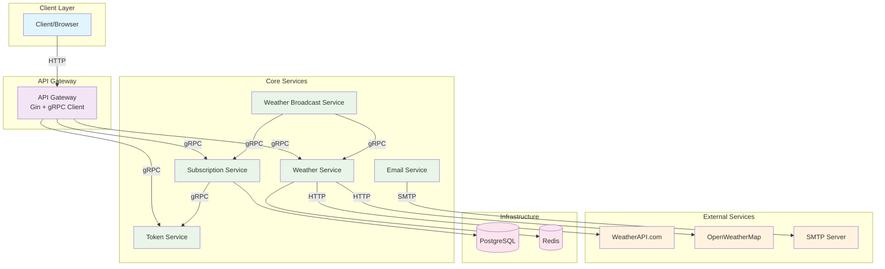
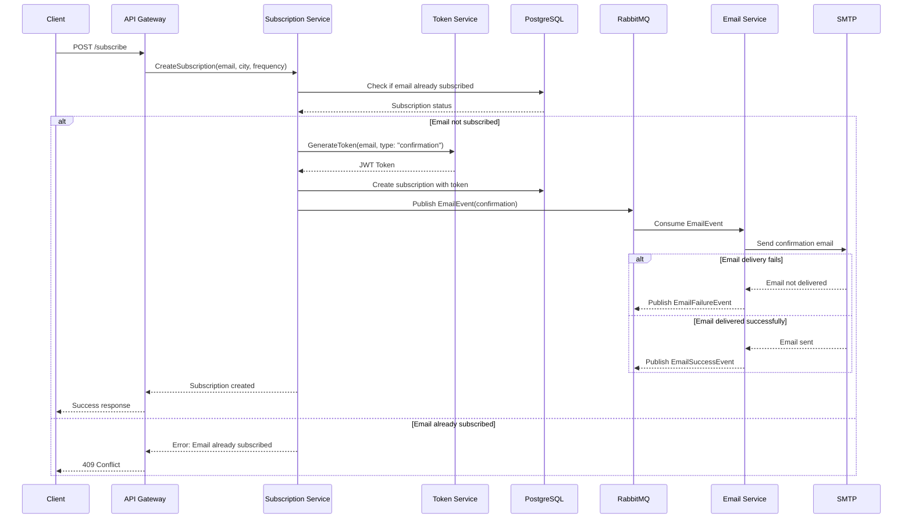
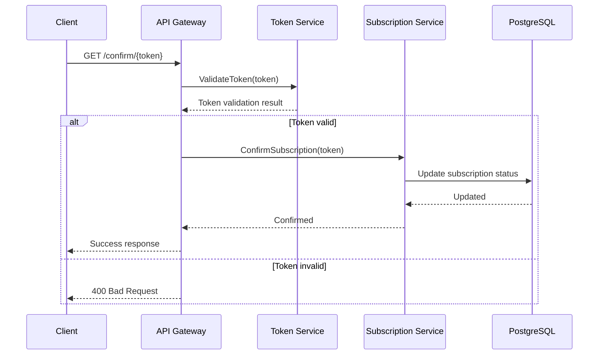
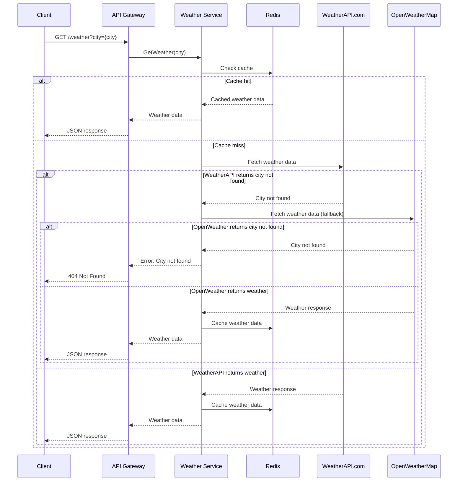
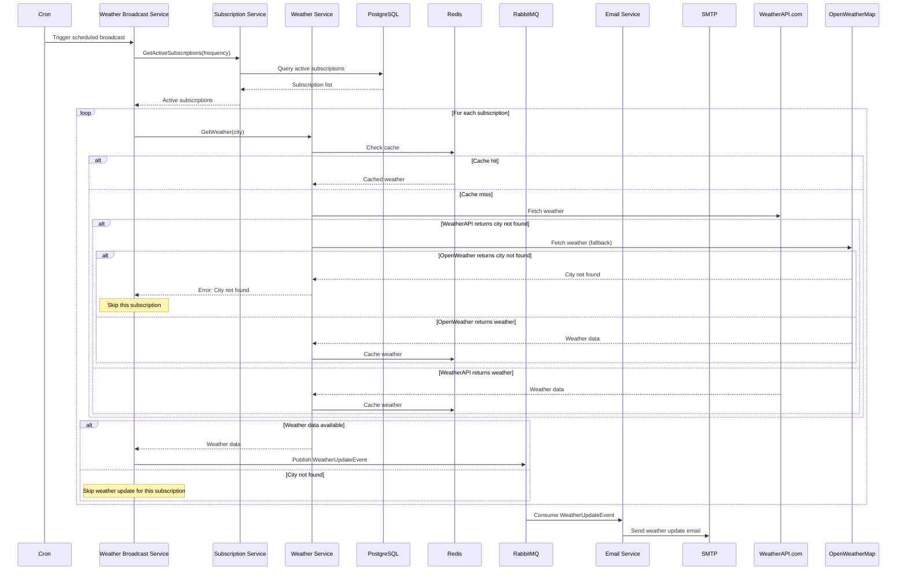

# Microservice Architecture Design

---

## Implementation Consideration

During the implementation phase, I will test and evaluate whether **gRPC** or **HTTP/REST** provides better performance for service-to-service communication for my case.
The current architecture assumes gRPC for internal communication, but I maintain flexibility to switch to HTTP/REST if testing shows it's more suitable for our scale and requirements.

---

## Overview

This document describes the proposed microservice architecture for the weather subscription system, breaking down the monolithic application into focused, independently deployable services.

---

## Microservice Description

### 1. API Gateway
**Purpose**: Single entry point for all client requests

**Responsibilities**:
- Route HTTP requests to appropriate microservices
- Handle request/response transformation

**Endpoints**:
- `GET /weather` - Weather information
- `POST /subscribe` - Create subscription
- `GET /confirm/{token}` - Confirm subscription
- `GET /unsubscribe/{token}` - Remove subscription

---

### 2. Subscription Service
**Purpose**: Core business logic for subscription management

**Responsibilities**:
- Create, read, update, delete subscriptions
- Provide subscription data for broadcasting
- Serve static HTML page for subscription interface

**Core Functions**:
- Subscription CRUD operations
- Data persistence

**Communication**:
- Publishes events to RabbitMQ for email notifications
- Receives gRPC calls from API Gateway
- Provides gRPC endpoints for Weather Broadcast Service
- gRPC calls to Token Service for token operations

**Technology Stack**:
- PostgreSQL for data persistence
- gRPC server/client
- RabbitMQ publisher

---

### 3. Token Service
**Purpose**: Token generation, validation

**Responsibilities**:
- Generate secure JWT tokens for subscription confirmation
- Validate token authenticity and expiration

**Core Functions**:
- JWT token generation with configurable expiration
- Token validation and verification (signature, expiration, structure)

**Token Storage Strategy**:
- **JWT tokens are stateless** - no permanent storage required
- **Subscription Service** stores tokens in PostgreSQL with subscription data

**Communication**:
- Receives gRPC calls from Subscription Service for token generation
- Receives gRPC calls from API Gateway for token validation
- Provides gRPC endpoints for token operations

**Technology Stack**:
- Go with JWT library
- gRPC server

---

### 4. Weather Service
**Purpose**: External weather data integration and caching

**Responsibilities**:
- Fetch weather data from external APIs
- Cache weather results to reduce API calls
- Provide weather data to other services

**Core Functions**:
- Weather data retrieval from WeatherAPI.com and OpenWeatherMap
- Redis caching for weather results
- City validation against external API

**Communication**:
- HTTP calls to external weather APIs
- gRPC server for internal service communication
- Redis for caching

**Technology Stack**:
- Go with weather API integration
- Redis for caching
- gRPC server
- HTTP client for external APIs

---

### 5. Weather Broadcast Service
**Purpose**: Scheduled weather updates delivery

**Responsibilities**:
- Execute scheduled weather broadcasts (hourly/daily)
- Coordinate between services for data collection
- Manage broadcast scheduling and execution
- Handle broadcast failures and retries

**Core Functions**:
- Scheduled job execution (cron-based)
- Subscription data collection
- Weather data aggregation
- Email notification triggering

**Communication**:
- gRPC calls to Subscription Service for active subscriptions
- gRPC calls to Weather Service for weather data
- Publishes events to RabbitMQ for email delivery
- Receives scheduling triggers

**Technology Stack**:
- Go with cron scheduling
- gRPC client for service communication
- RabbitMQ publisher
- Job queue management

---

### 6. Email Service
**Purpose**: Email delivery and management

**Responsibilities**:
- Send confirmation emails
- Send weather update emails
- Handle email delivery failures
- Manage email templates
- Validate email addresses during sending

**Core Functions**:
- SMTP integration
- Email template rendering
- Delivery status tracking
- Email validation and bounce handling
- Email existence verification during delivery

**Communication**:
- Consumes events from RabbitMQ
- SMTP communication for email delivery
- Event publishing for delivery status

**Technology Stack**:
- Go with SMTP integration
- RabbitMQ consumer
- Email template engine
- SMTP client

---

## Communication Patterns

### gRPC
- API Gateway ↔ Subscription Service
- API Gateway ↔ Weather Service
- API Gateway ↔ Token Service
- Subscription Service ↔ Token Service
- Weather Broadcast Service ↔ Subscription Service
- Weather Broadcast Service ↔ Weather Service

### RabbitMQ
- Subscription Service → Email Service (confirmation emails)
- Weather Broadcast Service → Email Service (weather updates)

### External Communication
- Weather Service → WeatherAPI.com and OpenWeatherMap (HTTP)
- Email Service → SMTP Server

---

## Service Communication Diagram

### High-Level Architecture Overview

### Detailed Communication Flows

#### 1. New Subscription Flow

#### 2. Subscription Confirmation Flow

#### 3. Weather Request Flow

#### 4. Scheduled Weather Broadcast Flow

### Communication Patterns Summary

**Service Abbreviations:**
- **AG** = API Gateway
- **SS** = Subscription Service  
- **TS** = Token Service
- **WS** = Weather Service
- **WBS** = Weather Broadcast Service
- **ES** = Email Service

| Service | Incoming gRPC | Outgoing gRPC | RabbitMQ Publisher | RabbitMQ Consumer | External APIs |
|---------|---------------|---------------|-------------------|-------------------|---------------|
| **Subscription Service** | AG, WBS | TS | Email events | - | - |
| **Token Service** | AG, SS | - | - | - | - |
| **Weather Service** | AG, WBS | - | - | - | WeatherAPI.com and OpenWeatherMap |
| **Weather Broadcast Service** | - | SS, WS | Weather events | - | - |
| **Email Service** | - | - | - | Email events | SMTP Server |

### Data Storage Patterns

| Service | Primary Storage | Cache | Message Queue |
|---------|----------------|-------|---------------|
| **Subscription Service** | PostgreSQL | - | RabbitMQ Publisher |
| **Token Service** | - | - | - |
| **Weather Service** | - | Redis | - |
| **Weather Broadcast Service** | - | - | RabbitMQ Publisher |
| **Email Service** | - | - | RabbitMQ Consumer |
