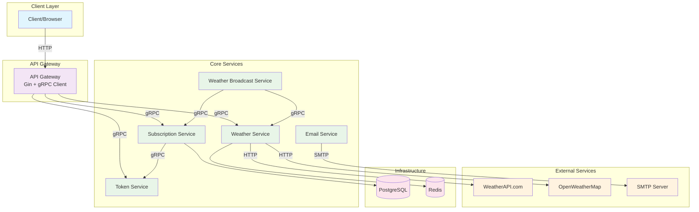
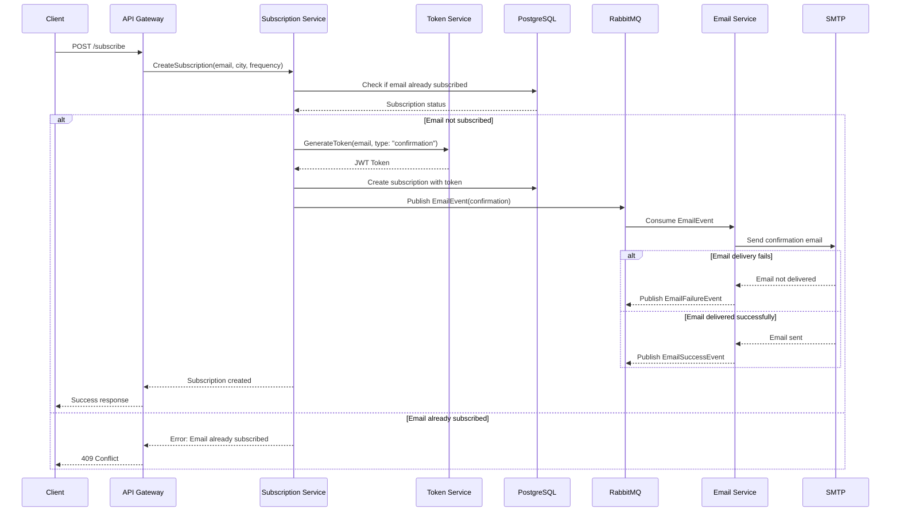
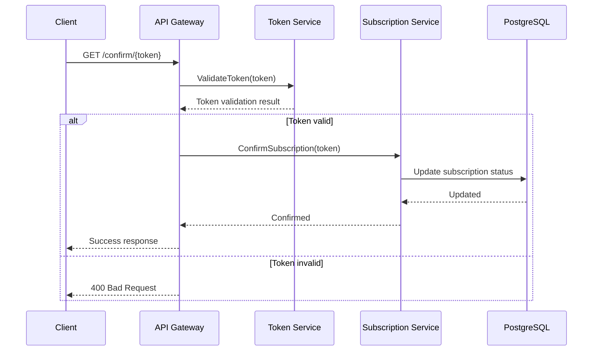
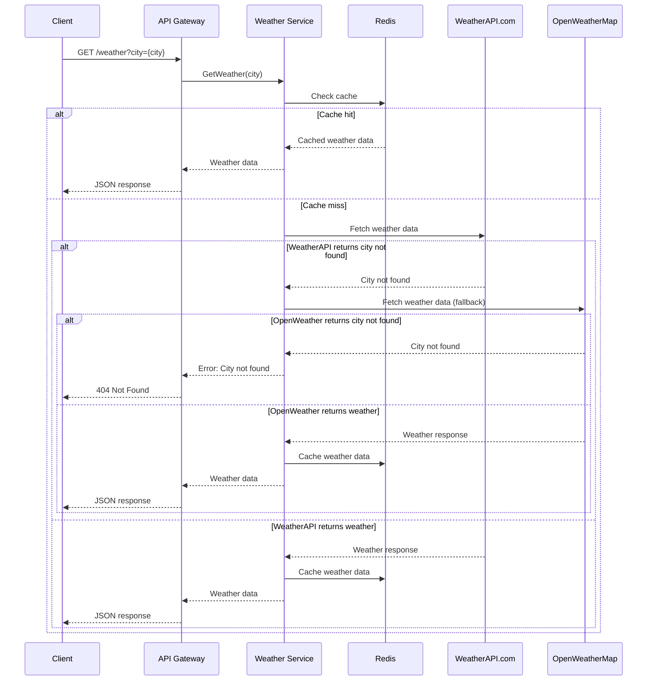
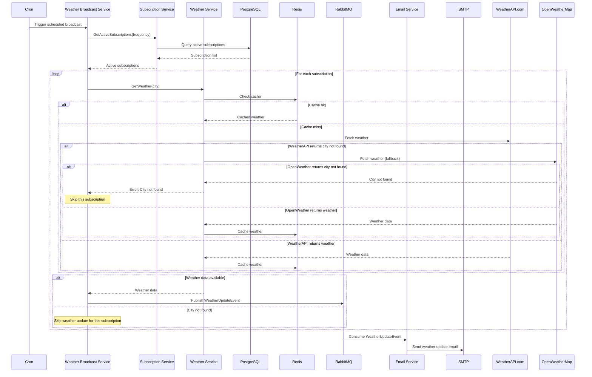

# Microservice Architecture Design

---

## Implementation Consideration

## Performance Testing

### Protocol Performance Comparison

To evaluate which protocol provides better performance, test these specific service pairs:

1. **Weather-Broadcast → Subscription/Email/Weather** (gRPC communication) - Test internal service communication performance and latency for weather broadcast operations.

2. **Gateway → Weather-Broadcast/Subscription/Token/Weather** (HTTP/REST) - Measure external API response times and throughput for client-facing operations.

3. **Subscription → Email** (gRPC) - Evaluate the performance of subscription confirmation and email notification flows, which are critical user-facing operations.

### Performance Criteria

The main metrics to test are latency (P95 response times), throughput (requests per second), and resource utilization (CPU/memory usage) under different load conditions for each service pair.

## Observability

### Current Implementation

**Metrics Collection**: Each service exposes Prometheus metrics via `/metrics` endpoints, with comprehensive tracking of HTTP/gRPC requests, database operations, RabbitMQ events, and business metrics (subscriptions, weather requests, email deliveries).

**Logging**: Structured logging with Zap logger across all services, configured with sampling for high-volume scenarios.

**Monitoring**: Prometheus scrapes metrics from all services every 5 seconds, with Grafana dashboards for visualization.

### Observability Stack

```bash
# Prometheus Configuration
prometheus.yml - Scrapes metrics from all services
grafana-dashboard.json - Pre-configured dashboards

# Metrics Endpoints
GET /metrics - Available on all services (8080-8085)
```

### Recommended Additions

Distributed tracing with OpenTelemetry and Jaeger would complete the observability picture by providing request flow visibility across service boundaries.

## Caching

### Current Implementation

**Redis Caching**: Weather service implements Redis-based caching with configurable TTL (default 30 minutes) for weather data to reduce external API calls and improve response times.

**Cache Strategy**: 
- **TTL**: 30 minutes for weather data (configurable via `REDIS_TTL`)
- **Cache-Aside Pattern**: Weather data is cached after first fetch, subsequent requests serve from cache until TTL expires
- **No Manual Invalidation**: Cache expires automatically based on TTL, no manual cache invalidation logic implemented

**Cache Metrics**: Comprehensive Prometheus metrics track cache hits, misses, errors, and operation duration for monitoring cache performance.

### Cache Configuration

```bash
# Redis Configuration (Weather Service)
REDIS_ADDRESS=redis:6379
REDIS_TTL=30m
REDIS_POOL_SIZE=10
REDIS_MIN_IDLE_CONNS=5
```

## Failure Handling

### Current Implementation

**Circuit Breaker Pattern**: Services implement basic retry logic with exponential backoff for external API calls (weather APIs, SMTP).

**Graceful Degradation**: Weather service uses fallback providers (WeatherAPI.com → OpenWeatherMap) when primary API fails.

**Error Propagation**: Structured error responses with appropriate HTTP status codes and detailed error messages for debugging.

**Database Resilience**: Connection pooling and retry mechanisms for database operations with configurable timeouts and max retries.

### Failure Scenarios & Strategies

**External API Failures**:
- Weather Service: Primary API failure → fallback to secondary API → return cached data if available
- Email Service: SMTP failure → retry with exponential backoff → publish failure events to RabbitMQ

**Service Communication Failures**:
- gRPC calls: Timeout-based retries with circuit breaker pattern
- RabbitMQ: Message persistence with dead letter queues for failed message processing

**Database Failures**:
- Connection timeouts with retry logic
- Graceful shutdown handling to prevent data corruption

---

## Overview

This document describes the proposed microservice architecture for the weather subscription system, breaking down the monolithic application into focused, independently deployable services.

---

## Microservice Description

### 1. API Gateway
**Purpose**: Single entry point for all client requests

**Responsibilities**:
- Route HTTP requests to appropriate microservices
- Handle request/response transformation
- HTTP proxy to backend services

**Endpoints**:
- `GET /weather` - Weather information (proxies to Weather Service)
- `POST /subscribe` - Create subscription (proxies to Subscription Service)
- `GET /confirm/{token}` - Confirm subscription (proxies to Subscription Service)
- `GET /unsubscribe/{token}` - Remove subscription (proxies to Subscription Service)

**Communication**:
- HTTP proxy calls to Weather Service
- HTTP proxy calls to Subscription Service
- HTTP proxy calls to Token Service
- HTTP proxy calls to Weather-Broadcast Service

**Technology Stack**:
- Gin web framework
- HTTP client for service communication

---

### 2. Subscription Service
**Purpose**: Core business logic for subscription management

**Responsibilities**:
- Create, read, update, delete subscriptions
- Provide subscription data for broadcasting
- Serve static HTML page for subscription interface

**Core Functions**:
- Subscription CRUD operations
- Data persistence

**Communication**:
- Publishes events to RabbitMQ for email notifications
- Receives HTTP calls from API Gateway
- Provides gRPC endpoints for Weather Broadcast Service
- HTTP calls to Token Service for token operations

**Technology Stack**:
- PostgreSQL for data persistence
- gRPC server/client
- RabbitMQ publisher

---

### 3. Token Service
**Purpose**: Token generation, validation

**Responsibilities**:
- Generate secure JWT tokens for subscription confirmation
- Validate token authenticity and expiration

**Core Functions**:
- JWT token generation with configurable expiration
- Token validation and verification (signature, expiration, structure)

**Token Storage Strategy**:
- **JWT tokens are stateless** - no permanent storage required
- **Subscription Service** stores tokens in PostgreSQL with subscription data

**Communication**:
- Receives HTTP calls from Subscription Service for token generation
- Receives HTTP calls from API Gateway for token validation
- Provides HTTP endpoints for token operations

**Technology Stack**:
- Go with JWT library
- HTTP server (Gin)

---

### 4. Weather Service
**Purpose**: External weather data integration and caching

**Responsibilities**:
- Fetch weather data from external APIs
- Cache weather results to reduce API calls
- Provide weather data to other services

**Core Functions**:
- Weather data retrieval from WeatherAPI.com and OpenWeatherMap
- Redis caching for weather results
- City validation against external API

**Communication**:
- HTTP calls to external weather APIs
- HTTP server for API Gateway communication
- gRPC server for internal service communication
- Redis for caching

**Technology Stack**:
- Go with weather API integration
- Redis for caching
- HTTP server (Gin) + gRPC server
- HTTP client for external APIs

---

### 5. Weather Broadcast Service
**Purpose**: Scheduled weather updates delivery

**Responsibilities**:
- Execute scheduled weather broadcasts (hourly/daily)
- Coordinate between services for data collection
- Manage broadcast scheduling and execution
- Handle broadcast failures and retries

**Core Functions**:
- Scheduled job execution (cron-based)
- Subscription data collection
- Weather data aggregation
- Email notification triggering

**Communication**:
- HTTP server for API Gateway communication
- gRPC calls to Subscription Service for active subscriptions
- gRPC calls to Weather Service for weather data
- gRPC calls to Email Service for email delivery
- Publishes events to RabbitMQ for email delivery
- Receives scheduling triggers

**Technology Stack**:
- Go with cron scheduling
- HTTP server (Gin) + gRPC client for service communication
- RabbitMQ publisher
- Job queue management

---

### 6. Email Service
**Purpose**: Email delivery and management

**Responsibilities**:
- Send confirmation emails
- Send weather update emails
- Handle email delivery failures
- Manage email templates
- Validate email addresses during sending

**Core Functions**:
- SMTP integration
- Email template rendering
- Delivery status tracking
- Email validation and bounce handling
- Email existence verification during delivery

**Communication**:
- HTTP server for direct access
- gRPC server for internal service communication
- Consumes events from RabbitMQ
- SMTP communication for email delivery
- Event publishing for delivery status

**Technology Stack**:
- Go with SMTP integration
- HTTP server (Gin) + gRPC server
- RabbitMQ consumer
- Email template engine
- SMTP client

---

## Communication Patterns

### HTTP/REST
- Gateway → Weather Service (HTTP proxy)
- Gateway → Subscription Service (HTTP proxy)
- Gateway → Token Service (HTTP proxy)
- Gateway → Weather-Broadcast Service (HTTP proxy)

### gRPC
- Weather-Broadcast Service → Subscription Service
- Weather-Broadcast Service → Email Service
- Weather-Broadcast Service → Weather Service
- Subscription Service → Email Service

### RabbitMQ
- Subscription Service → Email Service (confirmation emails)
- Weather-Broadcast Service → Email Service (weather updates)

### External Communication
- Weather Service → WeatherAPI.com and OpenWeatherMap (HTTP)
- Email Service → SMTP Server

---

## Service Communication Diagram

### High-Level Architecture Overview



### Detailed Communication Flows

#### 1. New Subscription Flow


#### 2. Subscription Confirmation Flow


#### 3. Weather Request Flow


#### 4. Scheduled Weather Broadcast Flow


### Communication Patterns Summary

**Service Abbreviations:**
- **AG** = API Gateway
- **SS** = Subscription Service
- **TS** = Token Service
- **WS** = Weather Service
- **WBS** = Weather Broadcast Service
- **ES** = Email Service

| Service | Incoming HTTP | Outgoing HTTP | Incoming gRPC | Outgoing gRPC | RabbitMQ Publisher | RabbitMQ Consumer | External APIs |
|---------|---------------|---------------|---------------|---------------|-------------------|-------------------|---------------|
| **Gateway** | Client | Weather, Subscription, Token, Weather-Broadcast | - | - | - | - | - |
| **Subscription Service** | Gateway | Token | Weather-Broadcast | Email | Email events | - | - |
| **Token Service** | Gateway, Subscription | - | - | - | - | - | - |
| **Weather Service** | Gateway | - | Weather-Broadcast | - | - | - | WeatherAPI.com and OpenWeatherMap |
| **Weather-Broadcast Service** | Gateway | - | - | Subscription, Weather, Email | Weather events | - | - |
| **Email Service** | - | - | Weather-Broadcast | - | - | Email events | SMTP Server |

### Data Storage Patterns

| Service | Primary Storage | Cache | Message Queue |
|---------|----------------|-------|---------------|
| **Subscription Service** | PostgreSQL | - | RabbitMQ Publisher |
| **Token Service** | - | - | - |
| **Weather Service** | - | Redis | - |
| **Weather Broadcast Service** | - | - | RabbitMQ Publisher |
| **Email Service** | - | - | RabbitMQ Consumer |