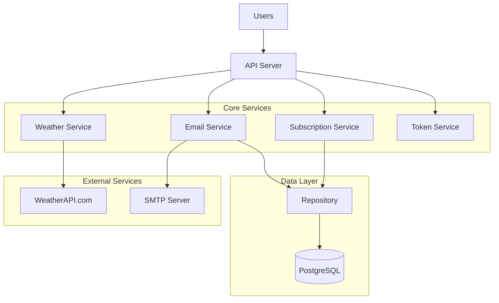
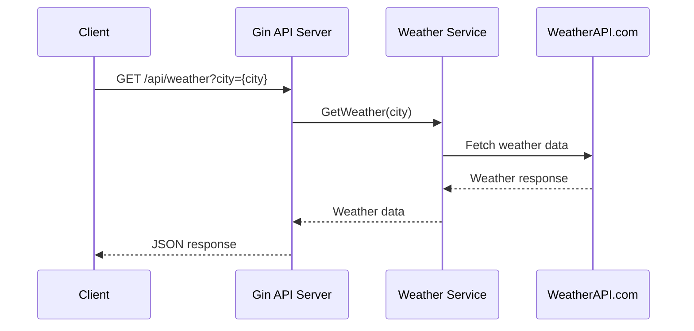
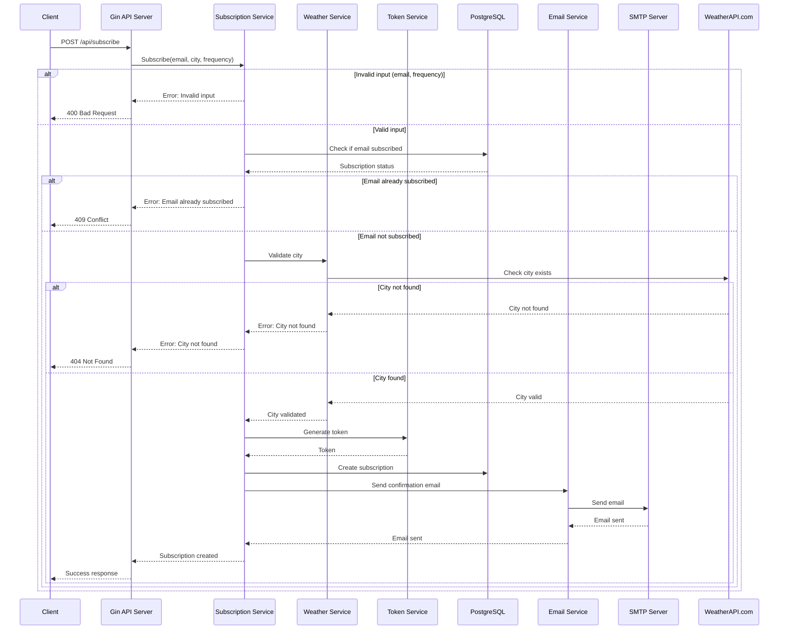
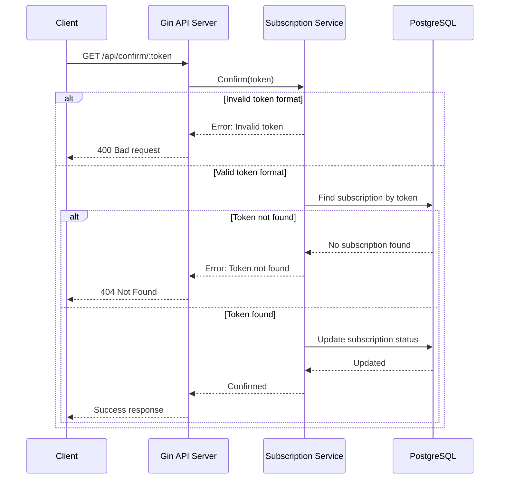
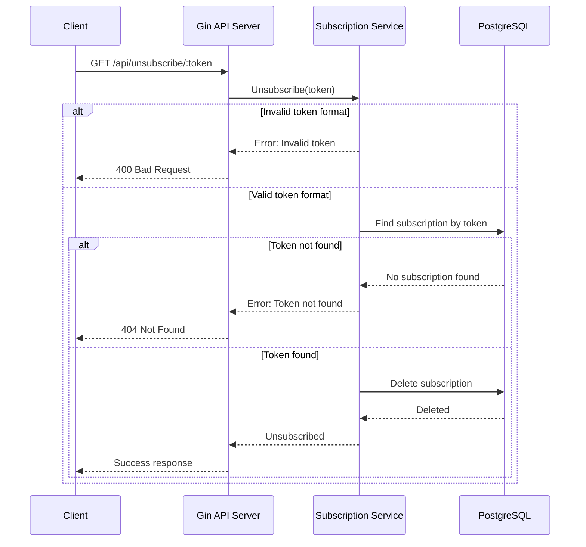

# System Design 

---

## 1. System Requirements

### Functional Requirements

- Users can subscribe/unsubscribe to weather updates for specific cities
- Users can choose notification frequency (hourly or daily)
- Users must confirm subscription via email
- System sends scheduled email notifications with weather information
- System validates city existence before subscription

### Non-Functional Requirements

#### Scalability:
- Support 100,000 active subscriptions
- Handle 50,000 email notifications per day

#### Security:
- All API inputs validated
- Secure token generation for confirmations/unsubscribe
- SMTP authentication for email delivery

### Constraints
- Free tier limitations of WeatherAPI.com

## 2. Load Estimation

### Users and Traffic

- Active users: 10,000
- Estimated subscriptions per user: 2-3
- API Requests per second: 15 rps
- Background jobs: 50,000 jobs/day

### Data Load

- Subscriptions: 200 bytes/record
- Total Database: ~15 GB/year

### Bandwidth

- Incoming: 500Kbps
- Outgoing: 2Mbps
- External API: 5Mbps


## 3.High-Level Architecture



## 4.Detailed component design
### 4.1 API Service & Endpoints

**Responsibilities:**

- Handle HTTP requests for weather service
- Validate input data
- Interact with business logic services
- Handle errors and logging
- Format JSON responses
- Route requests to appropriate handlers
- Validate confirmation and unsubscribe tokens
- Process weather subscription updates
- Send email notifications
- Fetch weather data
- Schedule periodic weather updates

**REST API Endpoints:**

```typescript
POST /api/subscribe
GET  /api/confirm/:token
GET  /api/unsubscribe/:token
GET  /api/weather?city={city}
```

## 5. Sequence Diagrams

### 5.1 Weather Request Flow


### 5.2 Subscription Flow


### 5.3 Confirmation Flow

### 5.4 Unsubscribe Flow
